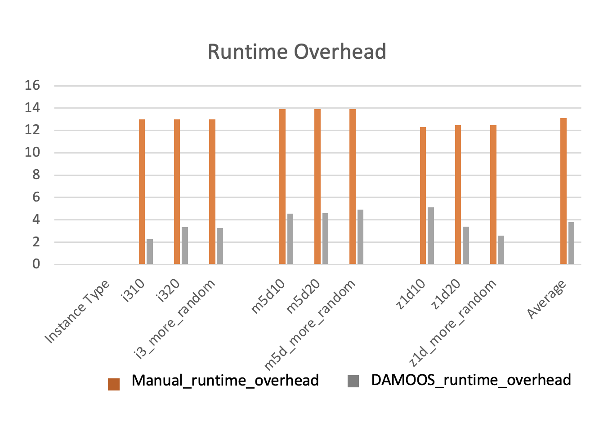
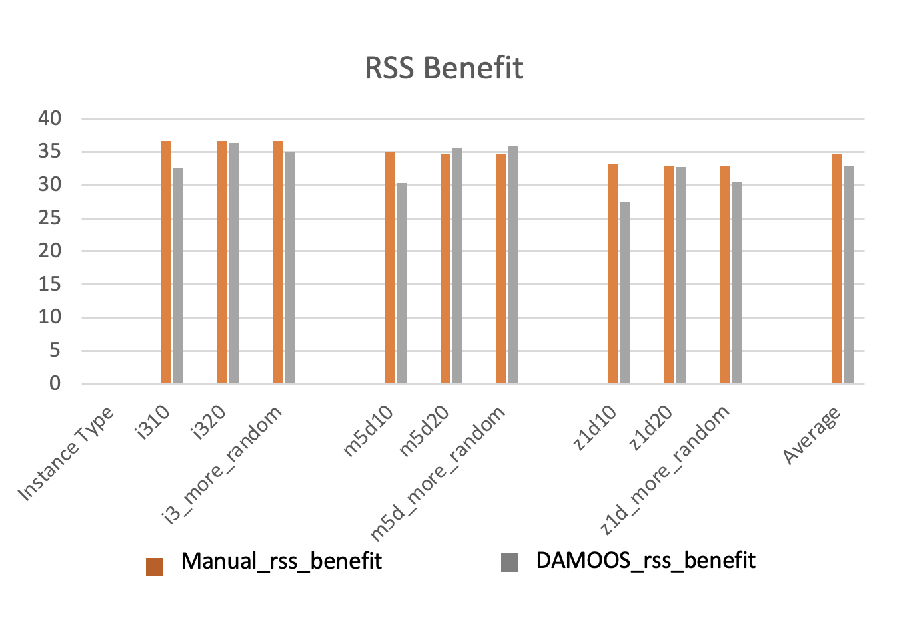
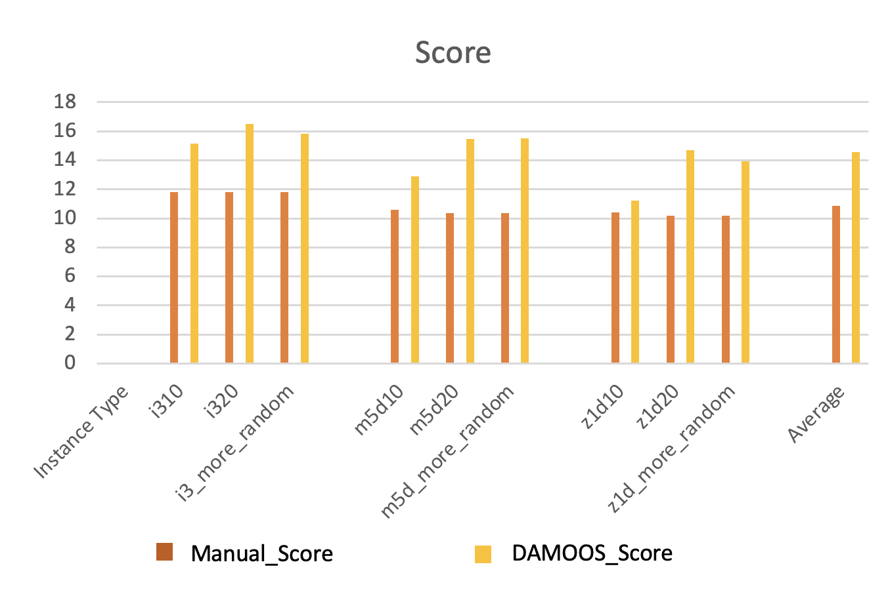
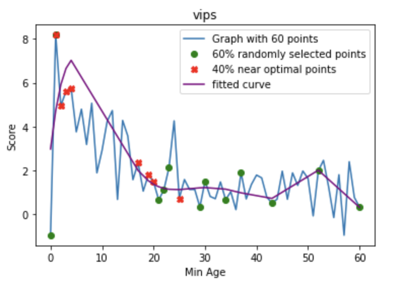

# polyfit_adapter

**polyfit_adapter** - This adapter uses polynomial fitting to find the best scheme in a huge and continuous search space. Only supports tuning one parameter at a time.

**polyfit_adapter.sh** - Works in following 5 steps:

a) num_runs = Number of times DAMOOS allowed to run the workload.

b) Explore search space with 60% of num_runs. (Divide the space into regions uniformly then sample randomly).

c) Exploit the best region with 40% of num_runs. (Select points randomly in the vicinity of the best points +-10% area).

d) Fit a Polynomial of degree min(num_runs/3, 10).

e) Find the peaks using roots of derivative and report.

The user needs to specify the search range and other details in a JSON file format as follows:

```
{
    "metrics": [
        "rss;full_avg",
        "runtime;stat"
    ],
    "workload": "dedup",
    "score_function": "sf.sh",
    "num_dimension": 1,
    "range": {
        "min_size": "4K",
        "max_size": "max",
        "min_age": [
            "0s",
            "60s"
        ],
        "max_age": "max",
        "min_freq": "min",
        "max_freq": "min",
        "action": "pageout"
    },
    "total_runtime": 10000000000000000,
    "num_runs": 20,
    "cache_file": "dedup",
    "read_from_cache": true,
    "write_to_cache": true,
    "cache_option": "check"
}
```
The JSON file should be added in the json_files directory.
1. metrics: Here the user needs to specify the metric name and the statistic used to process it for e.g. full_avg.

2. workload: The workloads name as specified in the workload directory.

3. score_function: The user needs to specify the score function in the form of a shell script. The shell script should be located in the polyfit_adapter directory.

4. num_dimension: This should be 1 in the case of polyfit_adapter. It essentially signifies how many parameters to tune at once.

5. range: Here the user needs to specify the scheme with all the parameters set to one default value and a list for the tunable parameter setting its min and max range. The action parameter is not tunable i.e. you can only specify ine action and not a list of actions.

6. Total_runtime and num_runs: Based of total runtime DAMOOS calculates the approximate number of runs as n = total_runtime/orig_runtime and takes the minimum of n and num_runs. If the total_runtime value is too big then essentially DAMOOS uses num_runs.

7. cache_file: The user can specify name of a cache file which will be saved as a hidden file in the caches folder. The values for score would be saved in the cache file for the current run of the workload which can be used later.

8. read_from_cache: This is a boolean variable, if set to true DAMOOS would read score values from cache to avoid duplicate runs of the same workload with a scheme.

9. write_to_cache: If enabled the values obtained on applying any new schemes to the workload would be saved to the cache. If this option is enabled with read_from_cache disabled, then the average of the collected metrics for a specified scheme would be saved.

10. cache_option: This option allows user to force delete the existing cache and create a new cache file using the "force" option. With the "check" option only if a file with the same name does not exist, a new file will be created otherwise the old file will be updated and read from.

**requirements.txt** - This file stores the inputs required by this scheme. It is used by the main damoos interface to ask the user for inputs.

## Results

**Workloads**: From Parsec3 and Splash2x Benchmark

**Systems used for experiments**: i3.metal, m5d.metal and z1d.metal instances.







**Graphs fit using polynomial fit adapter**

 

